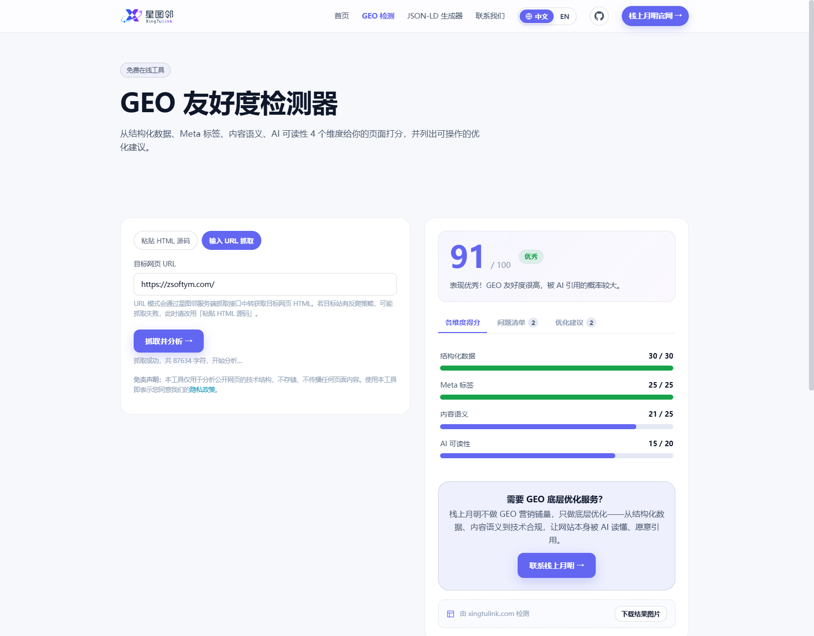
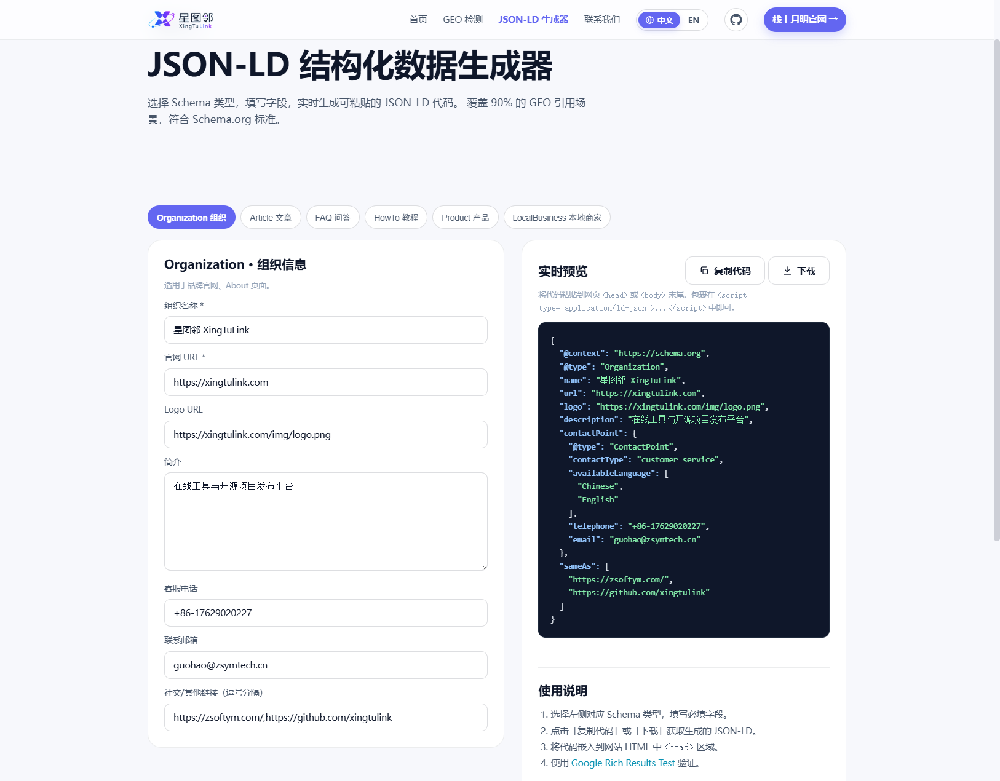
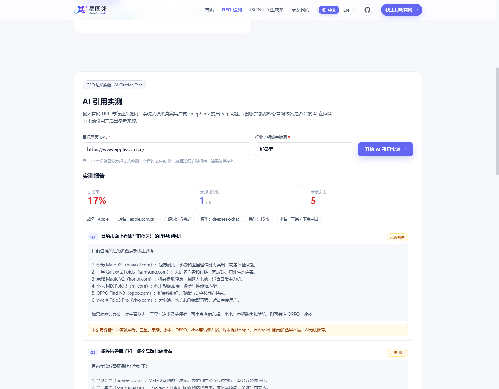

# GeoFriendlyChecker

One of the open-source projects by XingTuLink.

GeoFriendlyChecker is a lightweight, self-hostable GEO (Generative Engine Optimization) diagnostic tool. Give it a URL and it scores your page across four dimensions — structured data, meta tags, content semantics, and AI readability — with actionable optimization advice. It also ships an AI Citation Test that simulates real users asking an AI model whether your brand or domain shows up in its answers, plus a ready-to-use JSON-LD generator.

The paste-HTML check runs entirely in the browser with zero data upload; URL fetching and the citation test are handled by the bundled Node service.

## Features

### GEO Friendliness Check

- Enter a URL (fetched by the backend) or paste HTML source (parsed locally in the browser, nothing uploaded)
- Four-dimension score (out of 100): Structured Data · Meta Tags · Content Semantics · AI Readability
- Issue-by-issue diagnosis plus optimization suggestions, with a Canvas share-card export

### AI Citation Test

- Enter a target URL plus industry keywords
- The server auto-generates 6 neutral questions that never reveal the brand name, then asks DeepSeek one by one
- Hit detection is done locally with regular expressions (brand name / domain matching), not by asking the model to grade itself
- Progress streams over SSE and a run takes about 20–40 seconds; a failed question is skipped automatically, and one extra pass analyzes why uncited questions were missed

### JSON-LD Generator

- Supports Organization / Article / FAQ / HowTo / Product / LocalBusiness
- Fill in a form and get Schema.org-compliant code in real time, with one-click copy or download

The whole site is bilingual (Chinese / English).

## Screenshots

<!-- Screenshot placeholders: drop the images into img/ and replace the files, or edit the paths below -->

Home


GEO Friendliness Checker (with AI Citation Test)



JSON-LD Generator



AI Citation Test



## Code Layout

```
.
├── index.html                         Home page
├── 404.html / robots.txt / sitemap.xml
├── contact/index.html                 Contact info and privacy policy
├── tools/
│   ├── geo-checker/index.html         GEO checker page (includes the AI Citation Test)
│   └── json-ld-generator/index.html   JSON-LD generator page
├── public/                            Frontend: vanilla JS, no dependencies, no build step
│   ├── styles.css                     Site-wide styles
│   ├── i18n.js                        Chinese/English language switching
│   ├── site.js                        Nav, mobile menu, site-wide JSON-LD injection
│   ├── geo-checker.js                 Four-dimension checks, scoring, report rendering, share card
│   ├── citation-test.js               Citation test frontend (SSE handling and rendering)
│   └── json-ld-generator.js           Generator forms and code assembly
├── img/                               Logo and screenshots
└── server/                            Backend: Node built-in modules only, Node >= 18
    ├── server.js                      HTTP entry: static hosting + API routes + SSE
    ├── package.json                   npm start entry, no third-party dependencies
    ├── .env.example                   Environment variable template
    └── src/
        ├── env.js                     .env loading and config
        ├── store.js                   In-memory per-IP sliding-window rate limiting
        ├── static.js                  Static file serving (with path-traversal protection)
        ├── fetchPage.js               Page fetching (UA, redirects, timeout/size limits, SSRF guard)
        ├── extract.js                 Heuristic brand-name candidate extraction from page HTML
        ├── deepseek.js                DeepSeek Chat Completions client
        └── citation.js                Citation test pipeline: questions, prompting, hit detection, analysis
```

A single backend process serves both the static pages and three endpoints: `GET /api/health` (health check), `GET /api/fetch` (page fetch), and `POST /api/geo/citation-test` (citation test, progress streamed over SSE).

## Quick Start

### Local front-end checks (zero configuration)

The paste-HTML check needs no backend, but the pages reference assets with absolute paths, so serve them with any static server (double-clicking `index.html` loses the styles):

```bash
python -m http.server 8080
# or
npx serve .
```

Then open `http://localhost:8080/tools/geo-checker/` and switch to the "Paste HTML Source" tab.

### Full service (URL fetching + AI Citation Test)

No dependencies to install; requires Node.js 18+:

```bash
cd server
cp .env.example .env        # Windows: use copy
# edit .env and fill in DEEPSEEK_API_KEY
node server.js              # or npm start; port 8080 by default
```

The server runs fine without `DEEPSEEK_API_KEY`; only the AI Citation Test is unavailable.

## Environment Variables

| Variable | Required | Default | Description |
| --- | --- | --- | --- |
| `PORT` | No | `8080` | Port the server listens on |
| `DEEPSEEK_API_KEY` | Required for the citation test | None | DeepSeek API key, read only on the server, never sent to the browser |
| `DEEPSEEK_MODEL` | No | `deepseek-chat` | Model to call |
| `DEEPSEEK_BASE_URL` | No | `https://api.deepseek.com` | API base URL; point it at a self-hosted relay if needed |
| `CITATION_RATE_MAX` | No | `2` | Max citation tests per IP per window; set to `false` (or `0` / `off`) to disable |
| `FETCH_RATE_MAX` | No | `20` | Max page fetches per IP per window; set to `false` (or `0` / `off`) to disable |
| `RATE_WINDOW_MS` | No | `60000` | Rate-limit window in milliseconds (1 minute by default) |

## Tech Stack

- Frontend: plain HTML / CSS / vanilla JS — no build step, no third-party dependencies
- Backend: Node.js native HTTP (`node:http` / `node:fs`, etc.) — zero third-party npm dependencies
- AI: DeepSeek API (OpenAI-compatible protocol, optional)
- Internationalization: Chinese / English

## License

MIT

---

**About**

XingTuLink ([xingtulink.com](https://xingtulink.com)) is an open-source technology brand under ZSoftYM ([zsoftym.com](https://zsoftym.com)). We keep releasing open-source tools in the AI space to help companies solve real problems — GeoFriendlyChecker is our first one.
